Integration_with_SC
================
HSY
2024-01-01

> 运行环境中的版本信息如下：R (4.2.1), Seurat (4.1.1), SPOTlight
> (1.0.0), UCell (2.0.1)

## Integration with single-cell RNA-seq data

### a. signature score

最简单的方式。在以往单细胞分析中，类似的做法已经被广泛使用。

``` r
library(Seurat)
```

    ## Attaching SeuratObject

    ## Attaching sp

``` r
library(tidyverse)
```

    ## ── Attaching packages
    ## ───────────────────────────────────────
    ## tidyverse 1.3.2 ──

    ## ✔ ggplot2 3.4.0     ✔ purrr   0.3.4
    ## ✔ tibble  3.1.8     ✔ dplyr   1.0.9
    ## ✔ tidyr   1.2.0     ✔ stringr 1.4.0
    ## ✔ readr   2.1.2     ✔ forcats 0.5.1
    ## ── Conflicts ────────────────────────────────────────── tidyverse_conflicts() ──
    ## ✖ dplyr::filter() masks stats::filter()
    ## ✖ dplyr::lag()    masks stats::lag()

``` r
library(UCell)

oneseuv = readRDS("data/ST_Seurat.rds")
oneseu = readRDS("data/scRNA_Seurat.rds")

#在单细胞数据集中找DEG
Idents(oneseu) = "Cell_type"
cluster_marker=FindAllMarkers(oneseu,logfc.threshold = 0.8,only.pos = T)
```

    ## Calculating cluster B cells
    ## Calculating cluster Epithelial cells
    ## Calculating cluster Mast cells
    ## Calculating cluster Myeloids
    ## Calculating cluster Stromal cells
    ## Calculating cluster T cells

``` r
cluster_marker=cluster_marker%>%filter(p_val_adj < 0.01)
cluster_marker$d = cluster_marker$pct.1-cluster_marker$pct.2
cluster_marker %>% ggplot(aes(x=d))+geom_density(aes(fill = cluster))+
  facet_wrap(.~cluster,ncol = 2)+
  theme(legend.position = "none")+
  geom_vline(xintercept = 0.2)
```

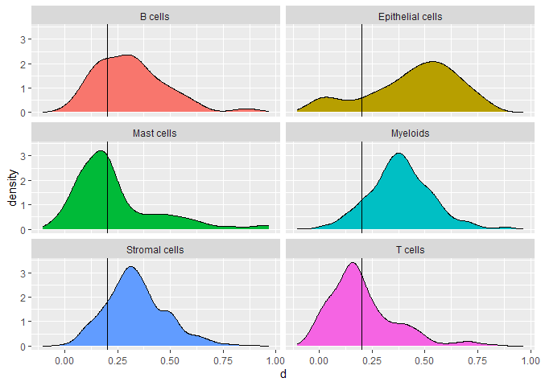<!-- -->

``` r
cluster_marker=cluster_marker %>% filter(d >= 0.2)
cluster_marker=cluster_marker%>%arrange(cluster,desc(avg_log2FC))
cluster_marker=cluster_marker%>%group_by(cluster) %>% top_n(30,wt = avg_log2FC)
cluster_marker=as.data.frame(cluster_marker)
cluster_marker = cluster_marker[,c("cluster","gene")]
geneset.list=split(cluster_marker$gene,cluster_marker$cluster)

#在空转数据集中打分
DefaultAssay(oneseuv) = "Spatial"
oneseuv = NormalizeData(oneseuv, normalization.method = "LogNormalize", scale.factor = 10000)
oneseuv <- AddModuleScore_UCell(oneseuv, features = geneset.list)

#画图
celltypes_ucell = colnames(oneseuv@meta.data)[8:13]
VlnPlot(oneseuv,features = celltypes_ucell,pt.size = 0,ncol = 3)
```

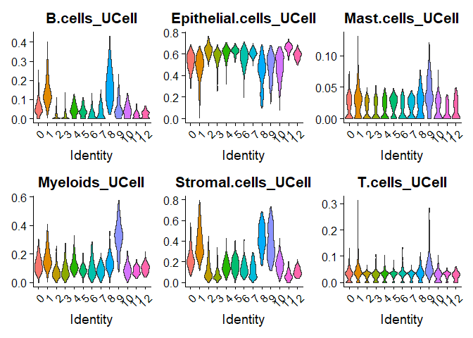<!-- -->

``` r
SpatialFeaturePlot(oneseuv,features = celltypes_ucell[1])
```

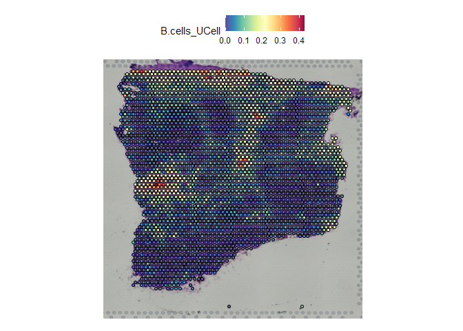<!-- -->

### b. MIA

``` r
# 找空间cluster的DEG，这一步也可以当成SVG的平替
DefaultAssay(oneseuv) = "SCT"
Idents(oneseuv)="seurat_clusters"
region_marker=FindAllMarkers(oneseuv,logfc.threshold = 0.25,only.pos = T)
```

    ## Calculating cluster 0

    ## Calculating cluster 1

    ## Calculating cluster 2

    ## Calculating cluster 3

    ## Calculating cluster 4

    ## Calculating cluster 5

    ## Calculating cluster 6

    ## Calculating cluster 7

    ## Calculating cluster 8

    ## Calculating cluster 9

    ## Calculating cluster 10

    ## Calculating cluster 11

    ## Calculating cluster 12

``` r
region_marker=region_marker%>%filter(p_val_adj < 0.05)
region_marker$d=region_marker$pct.1 - region_marker$pct.2
region_marker=region_marker%>%filter(d > 0.05)
region_marker=region_marker%>%arrange(cluster,desc(avg_log2FC))
region_marker=as.data.frame(region_marker)

# 找单细胞的deg
Idents(oneseu) = "Cell_type"
cluster_marker=FindAllMarkers(oneseu,logfc.threshold = 0.8,only.pos = T)
```

    ## Calculating cluster B cells

    ## Calculating cluster Epithelial cells

    ## Calculating cluster Mast cells

    ## Calculating cluster Myeloids

    ## Calculating cluster Stromal cells

    ## Calculating cluster T cells

``` r
cluster_marker=cluster_marker%>%filter(p_val_adj < 0.01)
cluster_marker$d = cluster_marker$pct.1-cluster_marker$pct.2
cluster_marker=cluster_marker %>% filter(d >= 0.2)
cluster_marker=cluster_marker%>%arrange(cluster,desc(avg_log2FC))
cluster_marker=as.data.frame(cluster_marker)

# 预备
region_specific=region_marker[,c("cluster","gene")]
colnames(region_specific)[1]="region"

celltype_specific=cluster_marker[,c("cluster","gene")]
colnames(celltype_specific)[1]="celltype"

N=length(union(rownames(oneseu),rownames(oneseuv)))

library(RColorBrewer)
library(scales)
```

    ## 
    ## 载入程辑包：'scales'

    ## The following object is masked from 'package:purrr':
    ## 
    ##     discard

    ## The following object is masked from 'package:readr':
    ## 
    ##     col_factor

``` r
color_region=c(
  brewer.pal(12, "Set3")[-c(2,3,9,12)],"#b3b3b3",
  brewer.pal(5, "Set1")[2],
  brewer.pal(3, "Dark2")[1],
  "#fc4e2a","#fb9a99"
)
names(color_region)=as.character(0:12)

# MIA分析
source("R/MIA_modified.R")
res.list = MIA_modified(region_specific,celltype_specific,N,color_region)
res.list$res.plot
```

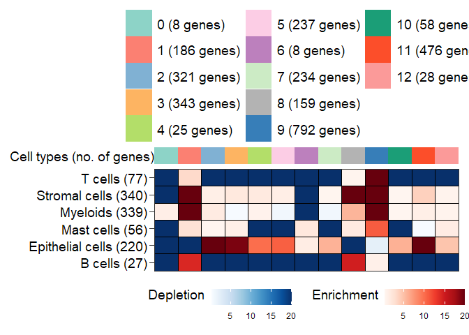<!-- -->

### c. SPOTlight

> 本地代码路径\[D:\202207Xi\_help.R\]

``` r
library(Seurat)
library(SPOTlight)
library(tidyverse)
library(ggcorrplot)
library(RColorBrewer)
library(scales)

### Loading the data
spe=readRDS("data/ST_Seurat.rds")
sce=readRDS("data/scRNA_Seurat.rds")

### 选基因
# 排除掉"^Rp[l|s]|Mt"
# 找差异基因时：Sort the genes from highest to lowest weight
rmgene=rownames(sce)[str_detect(rownames(sce),pattern = "^((RP[L|S])|(MT-))")]
rmgene=sort(rmgene)

hvg=VariableFeatures(sce)
hvg=setdiff(hvg,rmgene)

Idents(sce) = "Cell_type"
marker_ct=FindAllMarkers(sce,logfc.threshold = 1,min.pct = 0.1,only.pos = T)
```

    ## Calculating cluster B cells

    ## Calculating cluster Epithelial cells

    ## Calculating cluster Mast cells

    ## Calculating cluster Myeloids

    ## Calculating cluster Stromal cells

    ## Calculating cluster T cells

``` r
marker_ct=marker_ct%>%filter(p_val_adj < 0.01)
marker_ct$d=marker_ct$pct.1 - marker_ct$pct.2

ggplot(marker_ct,aes(x=d,color=cluster,fill=cluster))+
  geom_density()+
  geom_vline(xintercept = c(0.1,0.2))+
  facet_wrap(.~cluster,ncol = 2)
```

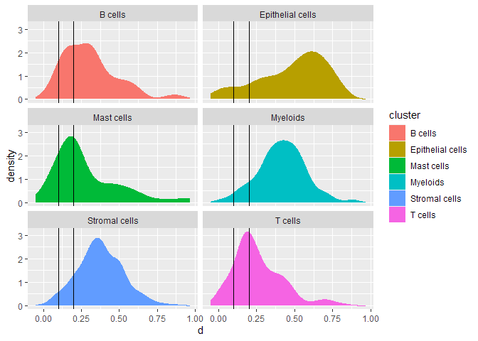<!-- -->

``` r
marker_ct=marker_ct%>%filter(d >= 0.1)
marker_ct=marker_ct[!marker_ct$gene %in% rmgene,]
marker_ct=marker_ct%>%arrange(cluster,desc(avg_log2FC))

### Cell Downsampling
# 如果cluster的差异较大，100个细胞就够；如果cluster差异较小，需要增加细胞数
# 尽可能从一个batch中提取细胞
idx <- split(seq(ncol(sce)), sce$Cell_type)
select_num <- 200
cb_keep <- lapply(
  idx,
  function (i) {
    n <- length(i)
    if (n < select_num) select_num <- n
    #print(select_num)
    sample(i, select_num)
  })
sce <- sce[, unlist(cb_keep)]

### Deconvolution
res.SPOTlight <- SPOTlight(
  x = sce@assays$RNA@counts,
  y = spe@assays$Spatial@counts,
  groups = as.character(sce$Cell_type),
  hvg = hvg,
  mgs = marker_ct,
  weight_id = "avg_log2FC",
  group_id = "cluster",
  gene_id = "gene"
)
```

    ## Scaling count matrix

    ## Seeding initial matrices

    ## Training NMF model

    ## Time for training: 1.66min

    ## Deconvoluting mixture data

查看结果

``` r
# Extract deconvolution matrix
# 也就是细胞占比矩阵
mat <- res.SPOTlight$mat
head(mat)
```

    ##                       B cells Epithelial cells Mast cells  Myeloids
    ## AAACAAGTATCTCCCA-1 0.07175447        0.2183714  0.1236995 0.2109532
    ## AAACAATCTACTAGCA-1 0.17836450        0.1634696  0.3911443 0.1275723
    ## AAACAGAGCGACTCCT-1 0.13440583        0.1732120  0.1674650 0.2007841
    ## AAACCCGAACGAAATC-1 0.18682130        0.2971557  0.2135328 0.1384274
    ## AAACCGGGTAGGTACC-1 0.28890246        0.2576113  0.1569406 0.1105509
    ## AAACCGTTCGTCCAGG-1 0.19588296        0.2434096  0.2627663 0.1061466
    ##                    Stromal cells    T cells
    ## AAACAAGTATCTCCCA-1    0.12664762 0.24857384
    ## AAACAATCTACTAGCA-1    0.10740400 0.03204531
    ## AAACAGAGCGACTCCT-1    0.18061520 0.14351781
    ## AAACCCGAACGAAATC-1    0.06785655 0.09620622
    ## AAACCGGGTAGGTACC-1    0.10000850 0.08598621
    ## AAACCGTTCGTCCAGG-1    0.07849455 0.11330004

``` r
# Extract NMF model fit
# NMF之后的关键矩阵都在mod里面
mod <- res.SPOTlight$NMF
```

可视化

``` r
### Topic profiles
# 这两张图模式越清晰，表示NMF提取topic越准确越有意义（，越近似一个topic表示一种细胞类型）
plotTopicProfiles(
  x = mod,
  y = sce$Cell_type,
  facet = FALSE,
  min_prop = 0.01,
  ncol = 1) +
  theme(aspect.ratio = 1)
```

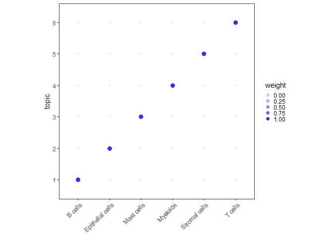<!-- -->

``` r
plotTopicProfiles(
  x = mod,
  y = sce$Cell_type,
  facet = TRUE,
  min_prop = 0.01,
  ncol = 3)
```

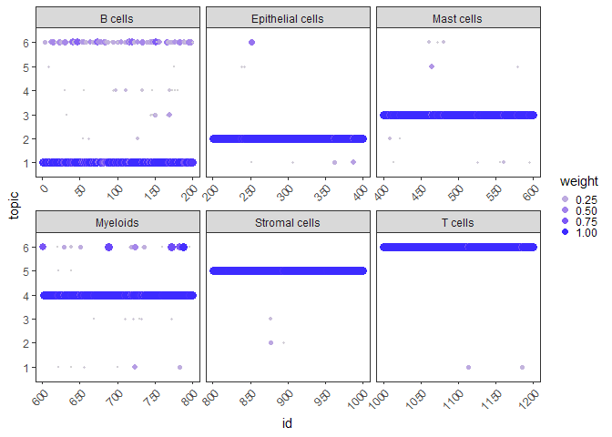<!-- -->

``` r
### Spatial Correlation Matrix
#也可以表示共定位
plotCorrelationMatrix(mat)
```

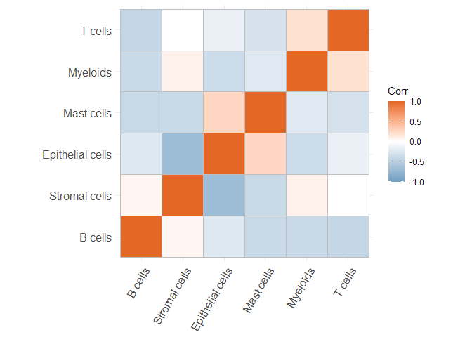<!-- -->

``` r
### Co-localization
plotInteractions(mat, which = "heatmap", metric = "prop")
```

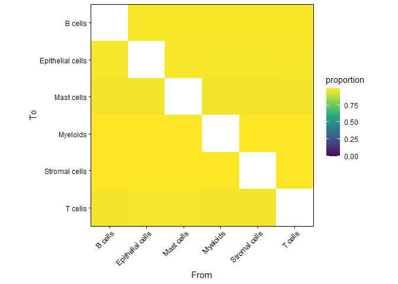<!-- -->

``` r
plotInteractions(mat, which = "heatmap", metric = "jaccard")
```

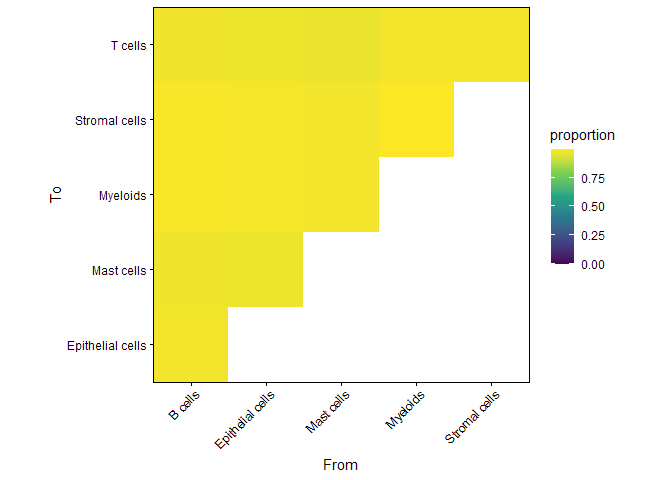<!-- -->

``` r
plotInteractions(mat, which = "network")
```

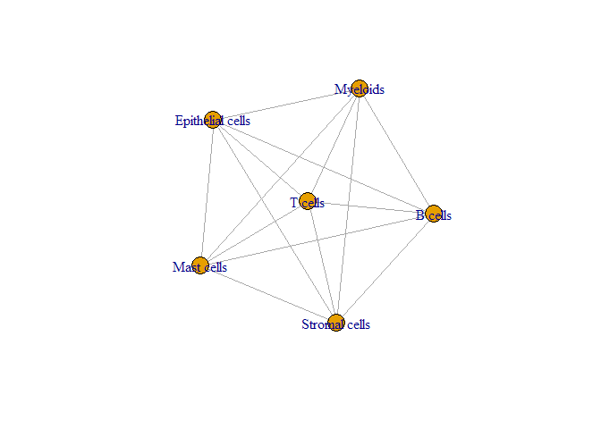<!-- -->

文章中，常见的可视化形式：Scatterpie

``` r
### Scatterpie
ct <- colnames(mat)
mat[mat < 0.1] <- 0

# Define color palette
paletteMartin <- c(
  "#000000", "#004949", "#009292", "#ff6db6", "#ffb6db", 
  "#490092", "#006ddb", "#b66dff", "#6db6ff", "#b6dbff", 
  "#920000", "#924900", "#db6d00", "#24ff24", "#ffff6d")

pal <- colorRampPalette(paletteMartin)(length(ct))
names(pal) <- ct

identical(colnames(spe),rownames(mat))
```

    ## [1] TRUE

``` r
plotSpatialScatterpie(
  x = spe,
  y = mat,
  cell_types = colnames(mat),
  img = FALSE,
  scatterpie_alpha = 1,
  pie_scale = 0.4) +
  scale_fill_manual(
    values = pal,
    breaks = names(pal)
  )
```

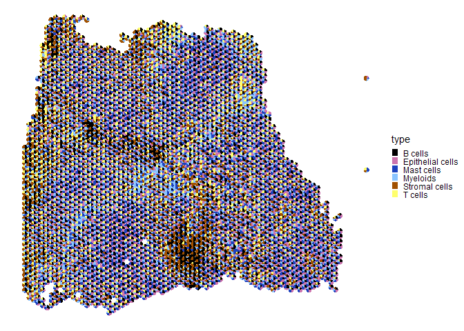<!-- -->

### d. SpaCET

> 本地代码路径\[D:\0.文章精讲\20230521\00.SpaCET学习.R\]
