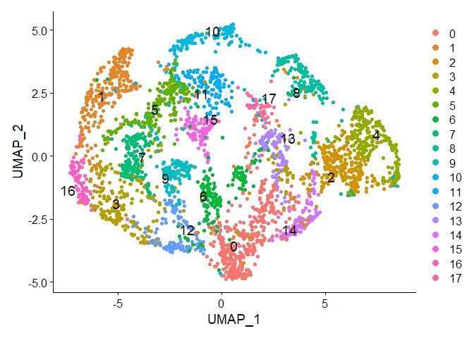
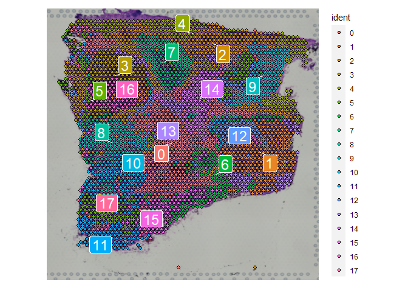
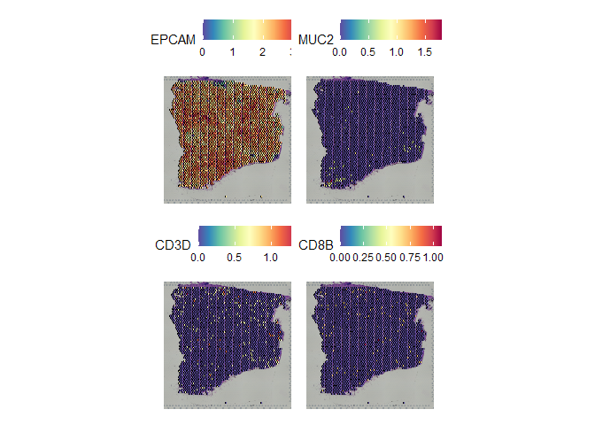
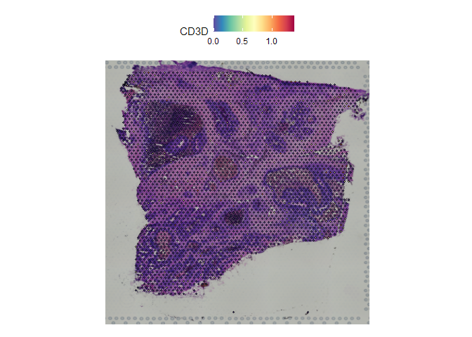
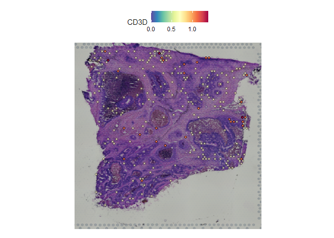

ST_pipeline
================
HSY
2023-12-31

该文档涉及空间转录组的几大分析板块，旨在为生物或医学背景的科研工作者提供专业的生物信息分析指南。

为了实现分析的可重复性，以下示例尽可能选择公开可获取的数据：

- [10X Visium — Human Colorectal Cancer: Whole Transcriptome
  Analysis](https://www.10xgenomics.com/resources/datasets/human-colorectal-cancer-whole-transcriptome-analysis-1-standard-1-2-0)

## 1. 基于Seurat的标准流程

> 运行环境中的版本信息如下：R(4.2.1), Seurat(4.1.1)

``` r
library(Seurat)
```

    ## Attaching SeuratObject

    ## Attaching sp

``` r
# Input data
oneseuv = Load10X_Spatial("D:/hsy/project/ST/data/10x/Human Colorectal Cancer Whole Transcriptome Analysis/")
```

    ## as(<dgTMatrix>, "dgCMatrix") is deprecated since Matrix 1.5-0; do as(., "CsparseMatrix") instead

``` r
# Normalization
oneseuv <- SCTransform(oneseuv, assay = "Spatial", verbose = FALSE)
# Dimensional reduction and clustering
oneseuv <- RunPCA(oneseuv, assay = "SCT", verbose = FALSE)
oneseuv <- FindNeighbors(oneseuv, reduction = "pca", dims = 1:30)
```

    ## Computing nearest neighbor graph

    ## Computing SNN

``` r
oneseuv <- FindClusters(oneseuv, verbose = FALSE)
oneseuv <- RunUMAP(oneseuv, reduction = "pca", dims = 1:30)
```

    ## 17:03:39 UMAP embedding parameters a = 0.9922 b = 1.112

    ## 17:03:39 Read 3138 rows and found 30 numeric columns

    ## 17:03:39 Using Annoy for neighbor search, n_neighbors = 30

    ## 17:03:39 Building Annoy index with metric = cosine, n_trees = 50

    ## 0%   10   20   30   40   50   60   70   80   90   100%

    ## [----|----|----|----|----|----|----|----|----|----|

    ## **************************************************|
    ## 17:03:40 Writing NN index file to temp file C:\Users\15927\AppData\Local\Temp\RtmpqMX2CN\file3bb84e6b6fad
    ## 17:03:40 Searching Annoy index using 1 thread, search_k = 3000
    ## 17:03:41 Annoy recall = 100%
    ## 17:03:41 Commencing smooth kNN distance calibration using 1 thread
    ## 17:03:41 Initializing from normalized Laplacian + noise
    ## 17:03:41 Commencing optimization for 500 epochs, with 130972 positive edges
    ## 17:03:49 Optimization finished

查看降维结果，可以使用以下代码：

``` r
DimPlot(oneseuv, reduction = "umap", pt.size = 1.5, label = TRUE,repel = T,label.size = 5)
```

<!-- -->

``` r
SpatialDimPlot(oneseuv, label = TRUE,repel = T,label.size = 6)
```

    ## Scale for fill is already present.
    ## Adding another scale for fill, which will replace the existing scale.

<!-- -->

如果想查看某些基因的表达量，可以使用以下代码：

``` r
SpatialFeaturePlot(oneseuv, features = c("EPCAM","MUC2", "CD3D","CD8B"),ncol = 2)
```

<!-- -->

``` r
SpatialFeaturePlot(oneseuv, features = "CD3D", pt.size.factor = 1) #表示spot原有大小
```

<!-- -->

``` r
SpatialFeaturePlot(oneseuv, features = "CD3D", alpha = c(0.1, 1)) #表达越低越透明
```

<!-- -->

## Detecting spatially-variable features

## Integration with single-cell RNA-seq data

### 打分

``` r
geneset = maintype_marker
geneset = geneset[, c("gene", "cluster")]
colnames(geneset)[2] = c("set")

for (i in unique(geneset$set)) {
    geneset_small = geneset %>%
        filter(set == i)
    genes.for.scoring <- list(geneset_small$gene)
    oneseuv <- AddModuleScore(object = oneseuv, features = genes.for.scoring, name = i)
}

colnames(oneseuv@meta.data)[8:18] = str_replace(colnames(oneseuv@meta.data)[8:18],
    "1$", "")

VlnPlot(oneseuv, features = colnames(oneseuv@meta.data)[8:18], pt.size = 0, ncol = 4)
SpatialFeaturePlot(oneseuv, features = colnames(oneseuv@meta.data)[8:18], ncol = 4)
```

## multiple slices

## 引用

这篇文档作为我们课题组所撰写综述的一部分，丰富了综述的内容，为读者提供了一个全面了解空间转录组的参考。如果我们的综述、文档对您的研究工作有所帮助，欢迎引用我们的综述：
