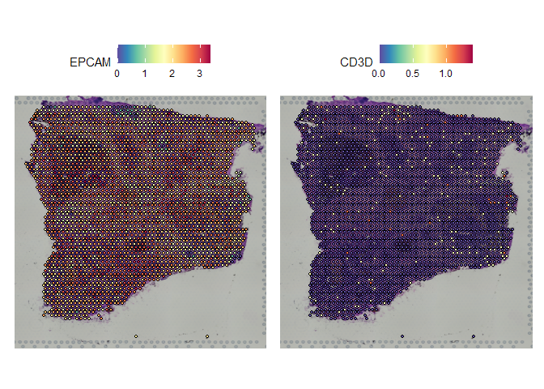

ST_pipeline
================
HSY
2023-12-31

该文档涉及空间转录组的几大分析板块，旨在为生物或医学背景的科研工作者提供专业的生物信息分析指南。

为了实现分析的可重复性，以下示例尽可能选择公开可获取的数据：

- [10X Visium — Human Colorectal Cancer: Whole Transcriptome
  Analysis](https://www.10xgenomics.com/resources/datasets/human-colorectal-cancer-whole-transcriptome-analysis-1-standard-1-2-0)

## 1. 基于Seurat的标准流程

> 运行环境中的版本信息如下：R (4.2.1), Seurat (4.1.1)

``` r
library(Seurat)
```

    ## Attaching SeuratObject

    ## Attaching sp

``` r
# Input data
oneseuv = Load10X_Spatial("D:/hsy/project/ST/data/10x/Human Colorectal Cancer Whole Transcriptome Analysis/")
```

    ## as(<dgTMatrix>, "dgCMatrix") is deprecated since Matrix 1.5-0; do as(., "CsparseMatrix") instead

``` r
# Normalization
oneseuv <- SCTransform(oneseuv, assay = "Spatial")
```

    ## Calculating cell attributes from input UMI matrix: log_umi

    ## Variance stabilizing transformation of count matrix of size 18900 by 3138

    ## Model formula is y ~ log_umi

    ## Get Negative Binomial regression parameters per gene

    ## Using 2000 genes, 3138 cells

    ##   |                                                                              |                                                                      |   0%  |                                                                              |==================                                                    |  25%  |                                                                              |===================================                                   |  50%  |                                                                              |====================================================                  |  75%  |                                                                              |======================================================================| 100%

    ## Found 95 outliers - those will be ignored in fitting/regularization step

    ## Second step: Get residuals using fitted parameters for 18900 genes

    ##   |                                                                              |                                                                      |   0%  |                                                                              |==                                                                    |   3%  |                                                                              |====                                                                  |   5%  |                                                                              |======                                                                |   8%  |                                                                              |=======                                                               |  11%  |                                                                              |=========                                                             |  13%  |                                                                              |===========                                                           |  16%  |                                                                              |=============                                                         |  18%  |                                                                              |===============                                                       |  21%  |                                                                              |=================                                                     |  24%  |                                                                              |==================                                                    |  26%  |                                                                              |====================                                                  |  29%  |                                                                              |======================                                                |  32%  |                                                                              |========================                                              |  34%  |                                                                              |==========================                                            |  37%  |                                                                              |============================                                          |  39%  |                                                                              |=============================                                         |  42%  |                                                                              |===============================                                       |  45%  |                                                                              |=================================                                     |  47%  |                                                                              |===================================                                   |  50%  |                                                                              |=====================================                                 |  53%  |                                                                              |=======================================                               |  55%  |                                                                              |=========================================                             |  58%  |                                                                              |==========================================                            |  61%  |                                                                              |============================================                          |  63%  |                                                                              |==============================================                        |  66%  |                                                                              |================================================                      |  68%  |                                                                              |==================================================                    |  71%  |                                                                              |====================================================                  |  74%  |                                                                              |=====================================================                 |  76%  |                                                                              |=======================================================               |  79%  |                                                                              |=========================================================             |  82%  |                                                                              |===========================================================           |  84%  |                                                                              |=============================================================         |  87%  |                                                                              |===============================================================       |  89%  |                                                                              |================================================================      |  92%  |                                                                              |==================================================================    |  95%  |                                                                              |====================================================================  |  97%  |                                                                              |======================================================================| 100%

    ## Computing corrected count matrix for 18900 genes

    ##   |                                                                              |                                                                      |   0%  |                                                                              |==                                                                    |   3%  |                                                                              |====                                                                  |   5%  |                                                                              |======                                                                |   8%  |                                                                              |=======                                                               |  11%  |                                                                              |=========                                                             |  13%  |                                                                              |===========                                                           |  16%  |                                                                              |=============                                                         |  18%  |                                                                              |===============                                                       |  21%  |                                                                              |=================                                                     |  24%  |                                                                              |==================                                                    |  26%  |                                                                              |====================                                                  |  29%  |                                                                              |======================                                                |  32%  |                                                                              |========================                                              |  34%  |                                                                              |==========================                                            |  37%  |                                                                              |============================                                          |  39%  |                                                                              |=============================                                         |  42%  |                                                                              |===============================                                       |  45%  |                                                                              |=================================                                     |  47%  |                                                                              |===================================                                   |  50%  |                                                                              |=====================================                                 |  53%  |                                                                              |=======================================                               |  55%  |                                                                              |=========================================                             |  58%  |                                                                              |==========================================                            |  61%  |                                                                              |============================================                          |  63%  |                                                                              |==============================================                        |  66%  |                                                                              |================================================                      |  68%  |                                                                              |==================================================                    |  71%  |                                                                              |====================================================                  |  74%  |                                                                              |=====================================================                 |  76%  |                                                                              |=======================================================               |  79%  |                                                                              |=========================================================             |  82%  |                                                                              |===========================================================           |  84%  |                                                                              |=============================================================         |  87%  |                                                                              |===============================================================       |  89%  |                                                                              |================================================================      |  92%  |                                                                              |==================================================================    |  95%  |                                                                              |====================================================================  |  97%  |                                                                              |======================================================================| 100%

    ## Calculating gene attributes

    ## Wall clock passed: Time difference of 53.5978 secs

    ## Determine variable features

    ## Place corrected count matrix in counts slot

    ## Centering data matrix

    ## Set default assay to SCT

``` r
# Dimensional reduction and clustering
oneseuv <- RunPCA(oneseuv, assay = "SCT")
```

    ## PC_ 1 
    ## Positive:  IGHG4, IGKC, IGHG1, IGLC2, COL1A1, COL1A2, COL3A1, IGHG3, SPARC, VIM 
    ##     MGP, APOE, IGHA1, C3, IGFBP7, IGLC1, IGLC3, AEBP1, JCHAIN, LUM 
    ##     COL6A2, BGN, CD74, IGHG2, TAGLN, DCN, SFRP2, HLA-DRA, COL6A1, GPNMB 
    ## Negative:  CKB, RPS19, RPS21, RPS4X, FABP1, RPL36A, RPL39, ID1, RPL34, RPL8 
    ##     RPS3A, PIGR, RPS6, RPL37A, SELENBP1, OLFM4, RPL7, FXYD3, RPL30, RPL13A 
    ##     CDH17, PHGR1, TFF3, CD24, KRT8, ELF3, ASCL2, NDRG1, GPX2, TSPAN8 
    ## PC_ 2 
    ## Positive:  APOE, CKB, PSAP, IFI30, ITGB2, ACTB, APOC1, LYZ, CTSB, PIGR 
    ##     CD74, NUPR1, HLA-DRB1, LAPTM5, TYROBP, MMP9, HLA-DQA1, HLA-DRA, ATF4, CTSD 
    ##     CD68, COL6A2, C1QB, APOC2, CAPG, CTSZ, FCER1G, ID1, HLA-DPA1, FTL 
    ## Negative:  MT-CO2, MT-CO1, MT-CO3, MT-ND4, MT-ND1, MT-ND3, MT-ATP6, MT-CYB, MT-ND2, IGKC 
    ##     IGHG4, IGHG1, IGLC2, MT-ND5, IGHG3, MTRNR2L12, RPL39, MALAT1, IGLC1, IGLC3 
    ##     MT-ND4L, AL627171.2, IGHA1, MTRNR2L8, RPS21, MT-ATP8, PABPC1, RPL30, RPS27, RPL41 
    ## PC_ 3 
    ## Positive:  IGHG4, IGHG1, IGKC, IGHG3, IGLC2, IGHA1, IGLC3, MGP, JCHAIN, IGLC1 
    ##     IGHG2, C3, SFRP2, AEBP1, MYL9, TAGLN, MALAT1, COL1A2, IGHM, SFRP4 
    ##     LUM, IGHA2, CCN1, BGN, COMP, ACTA2, MZB1, DCN, COL1A1, THBS1 
    ## Negative:  MT-CO1, MT-CO2, MT-ND4, MT-ND1, MT-CO3, MT-ATP6, SPP1, MT-ND2, APOC1, LYZ 
    ##     CTSB, MT-ND3, MMP9, IFI30, CHI3L1, FTL, LAPTM5, MT-CYB, CTSD, APOE 
    ##     TYROBP, ITGB2, CD74, CXCL10, HLA-DRA, APOC2, FCER1G, CD68, GPNMB, HLA-DRB1 
    ## PC_ 4 
    ## Positive:  IGKC, IGHG4, IGHG1, IGLC2, CKB, IGHG3, IGHA1, IGLC1, IGLC3, IGHG2 
    ##     ID1, FABP1, APOC1, APOE, JCHAIN, CD74, SELENBP1, FTL, LYZ, CHI3L1 
    ##     HLA-DRA, GPNMB, CTSD, RPL41, HLA-DRB1, ADGRG2, RPL10, APOC2, FXYD3, ADIRF 
    ## Negative:  OLFM4, COL4A1, CEACAM6, MYL9, TAGLN, COL4A2, MMP11, SPARC, ACTA2, POSTN 
    ##     IGFBP7, MT-CO1, COL12A1, COL5A2, SULF1, S100A4, COL1A2, HTRA3, CCN2, DMBT1 
    ##     COL3A1, COL5A1, COL6A2, MMP7, COL1A1, FLNA, CALD1, COL18A1, AEBP1, TIMP3 
    ## PC_ 5 
    ## Positive:  CKB, ID1, FABP1, FABP4, SFRP2, ADIRF, ADH1B, ADGRG2, SELENBP1, NDRG1 
    ##     GPX3, PLIN1, C7, FOS, SELENOP, EEF1A1, ADIPOQ, NNMT, IGFBP4, MT-CO1 
    ##     RPL41, SAA1, CFD, CCN1, EFEMP1, COL3A1, DCN, LUM, COL6A3, CD36 
    ## Negative:  IGHG4, MALAT1, IGKC, IGLC2, IGLC1, IGHG1, IGHG3, OLFM4, MYL9, SPP1 
    ##     CEACAM6, IFI6, FN1, CCDC88B, IGHA1, PMEPA1, KRT8, MMP9, MMP7, FLNA 
    ##     MTRNR2L12, TYMP, AEBP1, KRT18, IFI27, DES, CHI3L1, ISG15, JSRP1, MYH11

``` r
oneseuv <- FindNeighbors(oneseuv, reduction = "pca", dims = 1:30)
```

    ## Computing nearest neighbor graph

    ## Computing SNN

``` r
oneseuv <- FindClusters(oneseuv)
```

    ## Modularity Optimizer version 1.3.0 by Ludo Waltman and Nees Jan van Eck
    ## 
    ## Number of nodes: 3138
    ## Number of edges: 103762
    ## 
    ## Running Louvain algorithm...
    ## Maximum modularity in 10 random starts: 0.8344
    ## Number of communities: 18
    ## Elapsed time: 0 seconds

``` r
oneseuv <- RunUMAP(oneseuv, reduction = "pca", dims = 1:30)
```

    ## 19:26:37 UMAP embedding parameters a = 0.9922 b = 1.112

    ## 19:26:37 Read 3138 rows and found 30 numeric columns

    ## 19:26:37 Using Annoy for neighbor search, n_neighbors = 30

    ## 19:26:37 Building Annoy index with metric = cosine, n_trees = 50

    ## 0%   10   20   30   40   50   60   70   80   90   100%

    ## [----|----|----|----|----|----|----|----|----|----|

    ## **************************************************|
    ## 19:26:37 Writing NN index file to temp file C:\Users\15927\AppData\Local\Temp\RtmpSoPgjB\fileb742e443673
    ## 19:26:37 Searching Annoy index using 1 thread, search_k = 3000
    ## 19:26:38 Annoy recall = 100%
    ## 19:26:38 Commencing smooth kNN distance calibration using 1 thread
    ## 19:26:39 Initializing from normalized Laplacian + noise
    ## 19:26:39 Commencing optimization for 500 epochs, with 130972 positive edges
    ## 19:26:47 Optimization finished

查看降维结果，可以使用以下代码：

``` r
DimPlot(oneseuv, reduction = "umap", pt.size = 1.5, label = TRUE,repel = T,label.size = 5)
```

<!-- -->

``` r
SpatialDimPlot(oneseuv, label = TRUE,repel = T,label.size = 5)
```

    ## Scale for fill is already present.
    ## Adding another scale for fill, which will replace the existing scale.

<!-- -->

如果想查看某些基因的表达量，可以使用以下代码：

``` r
SpatialFeaturePlot(oneseuv, features = c("EPCAM","CD3D"),ncol = 2)
```

<!-- -->

``` r
SpatialFeaturePlot(oneseuv, features = "CD3D", pt.size.factor = 1) #表示spot原有大小
```

<!-- -->

``` r
SpatialFeaturePlot(oneseuv, features = "CD3D", alpha = c(0.1, 1)) #表达越低越透明
```

<!-- -->

## Detecting spatially-variable features

## Integration with single-cell RNA-seq data

### 打分

``` r
geneset = maintype_marker
geneset = geneset[, c("gene", "cluster")]
colnames(geneset)[2] = c("set")

for (i in unique(geneset$set)) {
    geneset_small = geneset %>%
        filter(set == i)
    genes.for.scoring <- list(geneset_small$gene)
    oneseuv <- AddModuleScore(object = oneseuv, features = genes.for.scoring, name = i)
}

colnames(oneseuv@meta.data)[8:18] = str_replace(colnames(oneseuv@meta.data)[8:18],
    "1$", "")

VlnPlot(oneseuv, features = colnames(oneseuv@meta.data)[8:18], pt.size = 0, ncol = 4)
SpatialFeaturePlot(oneseuv, features = colnames(oneseuv@meta.data)[8:18], ncol = 4)
```

## multiple slices

## 引用

这篇文档作为我们课题组所撰写综述的一部分，丰富了综述的内容，为读者提供了一个全面了解空间转录组的参考。如果我们的综述、文档对您的研究工作有所帮助，欢迎引用我们的综述：
